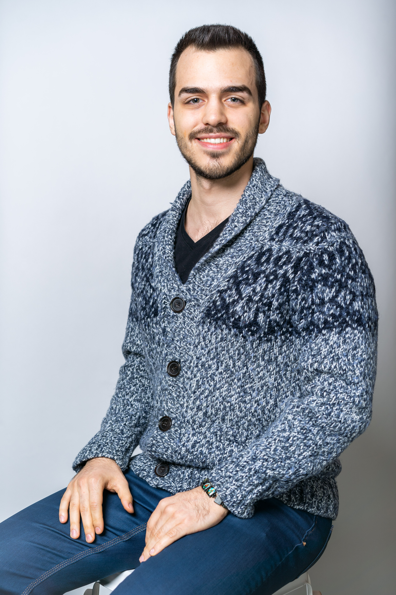
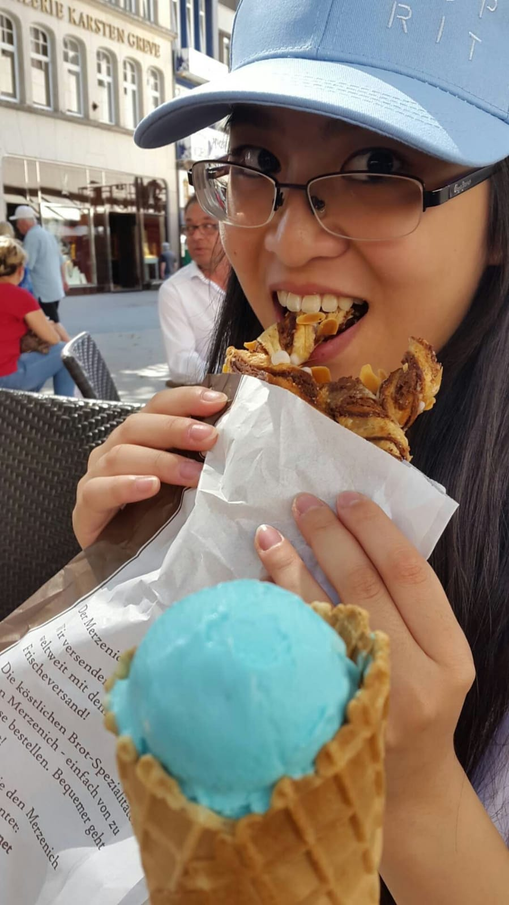
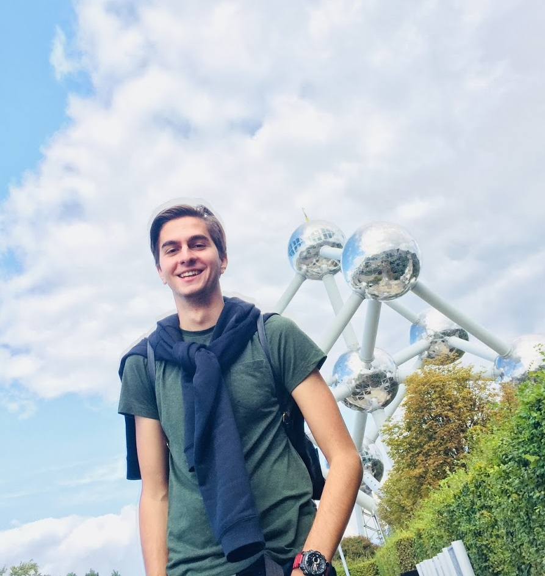

# CSE1105 Group 72

## Name: Wout Haakman
 
Personal Development Plan:
- Learn to work as a team
- Not being afraid to ask questions
- Being able to help teammembers wherever possible
- Making a sweet Java application

## Name: Giuliano Forghieri
 
Personal Development Plan:
- 
-
-
-

## Name: Gino Tramontina
 
Personal Development Plan:
- Getting used to working in a team
- Get better at programming

## Name: Mandy Chang
 
Personal Development Plan:
- Learn how to improve teamwork
- Learn how to program better and more efficiently
- Become better at managing and organising

## Name: Jan Willem Eriks
 
Personal Development Plan:
- Learning how to work with and program graphics in Java
- Learning how to use Git
- Learning how to program as a team

## Name: Svetoslav Stanoev
 
Personal Development plan:
- Broaden programming skills
- Getting together in a team and working on a project

## Name:
 
Personal Development Plan:
- Learning how to work in a team
- Improving my coding skills