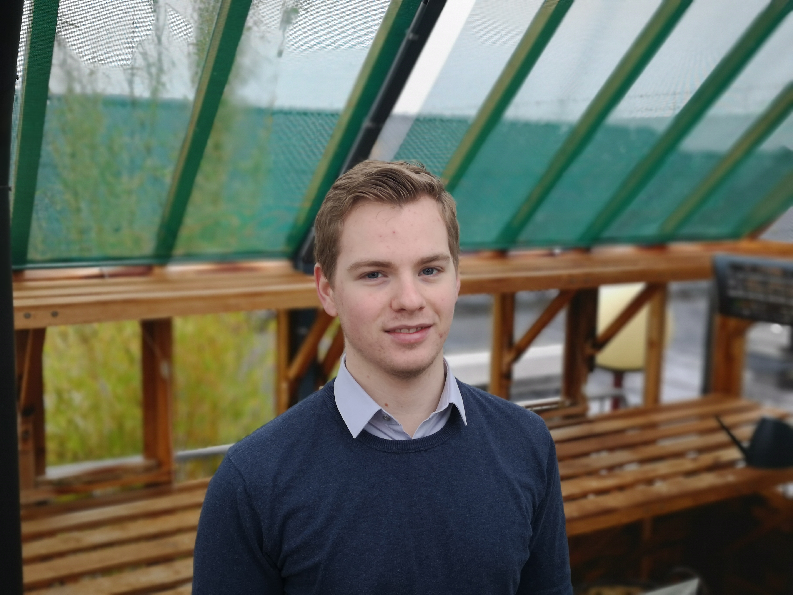

# CSE1105 Group 72

## Name: Wout Haakman

Personal Development Plan:
- Learn to work as a team
- Not being afraid to ask questions
- Being able to help teammembers wherever possible
- Making a sweet Java application

## Name: Giuliano Forghieri

Personal Development Plan:
-
-
-
-

## Name: Gino Tramontina

Personal Development Plan:
- Getting used to working in a team
- Get better at programming

## Name: Jan Willem Eriks

Personal Development Plan:
- Learning how to work with and program graphics in Java
- Learning how to use Git
- Learning how to program as a team

## Name:

## Name:

